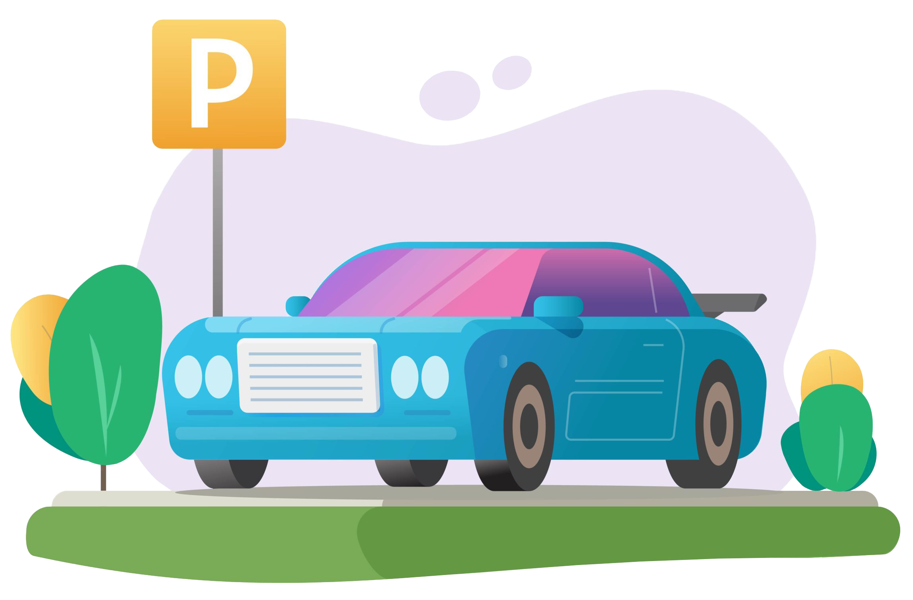

<h1 align="center">TP FINAL - GRUPO 7</h1>

   Este es nuestro proyecto para el Trabajo Práctico Final

 

    
    <h3>
        [Descripción](#descripción-📝)
         | 
        [Dominio](#dominio-🚀)
         | 
        [Construido con](#construido-con-🔨)
    </h3>

- <b>Nombre del grupo:</b> Grupo 7
- <b>Integrantes:</b> [Luis Miguel Cañete](https://github.com/Venserthesojourner), [Manuel Ortiz](https://github.com/hctmanuelortiz), [Marcos Andrés Travaglini](https://github.com/Blackpachamame)
- <b>Profesores:</b> Daniel Dolz y Mauro Sagripanti
- <b>Proyecto:</b> Gestión de Playas de Estacionamiento

## Descripción 📝

Se desea montar un sistema pensado para la gestión de playas de estacionamiento. Este sistema consistiría en una plataforma que le sirva particularmente a cada uno de los establecimientos a administrar los servicios de estacionamiento que proveen así como una herramienta para que los usuarios que deseen estacionar puedan hacerlo de manera más fácil y rápida.

## Dominio 🚀

La aplicación está destinada por un lado a los dueños de establecimientos de estacionamientos que desean mejorar la gestión de su negocio. Además, la plataforma permitirá establecer una centralización de la actividad, generando un estándar de manejo del negocio y de las características funcionales de la misma actividad. Está pensada además en la necesidad de los consumidores de este tipo de servicios, para agilizar el encuentro de esta clase de establecimientos, y consumir dichos servicios.

## Construido con 🔨

- Frontend: [Quasar + Capacitor](https://github.com/Venserthesojourner/EL-PROYECTICO-DEL-GRUPO-7/blob/master/frontEndTpFinal/README.md)
- Backend: [Nest JS](https://github.com/Venserthesojourner/EL-PROYECTICO-DEL-GRUPO-7/blob/master/back-end-tp-final/README.md)

<h6 align="center"> #Grupo 7 ❤️</h6>